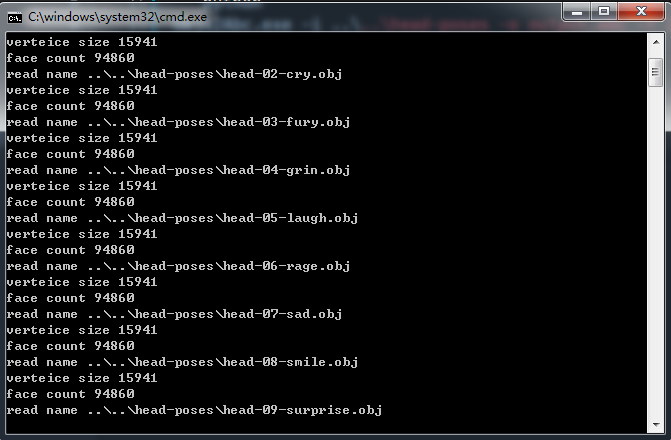
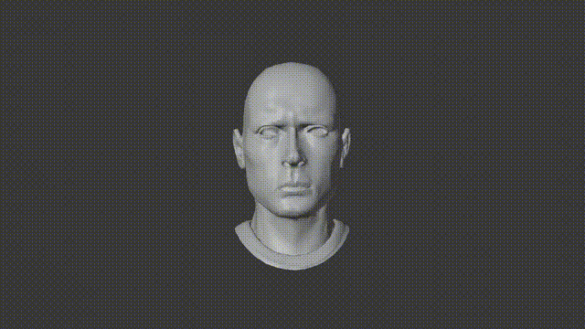
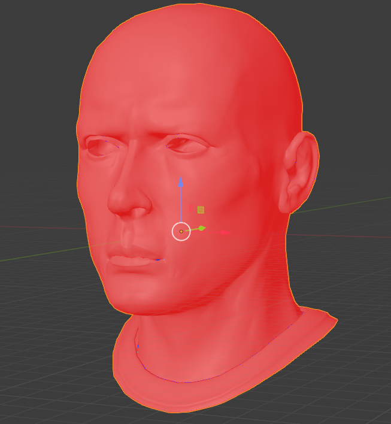

# convert_objs_to_abc tool

This is a tool which is to convert obj sequences to abc file. This code is based on [Alembic Library](https://github.com/alembic/alembic). I uploaded the builded lib in lib directory.(the lib is build in windows 7 64 bit system)

## useage  
### how to compile  
clone the code to local, and open it in vs 2019, compile, done!

### how to use  
befor using, shold know following:
* Let the obj sequence name like 0000.obj 0001.obj and so on
* Let the obj sequence have the same topology
```python
Objs2Abc.exe -i inputdir -o output.abc -f 24
```
example  
```python
Objs2Abc.exe -i ..\..\head-poses -o output.abc -f 24
```
  

result:  



### Problems  
* Maya cannot recongize the generated abc file  
if you want to import the abc to Maya, firsr import it to blender, then export abc file using blender. Maya import the abc file which is generated in blender. 
* Import the abc to blender, the normal is wrong 
    
  if you want to solve this normal problem, you should import the abc file to Maya, and using `flip normal` operation
* the abc file has no uv normal information!  
  if you  want to add this information to abc, please change the code and compile
